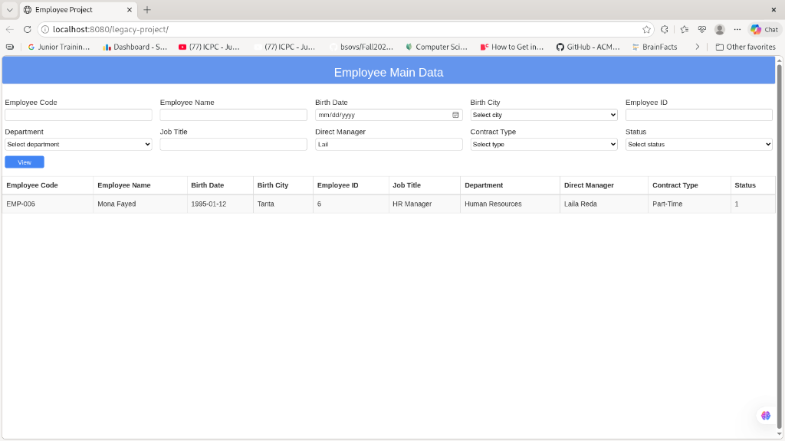
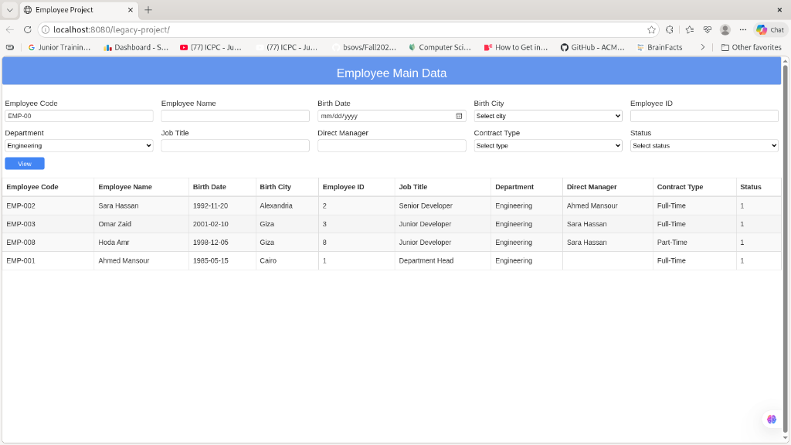
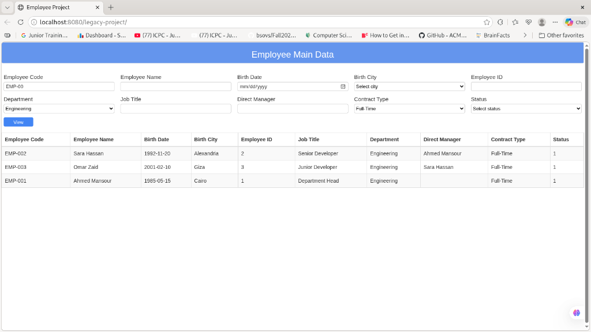
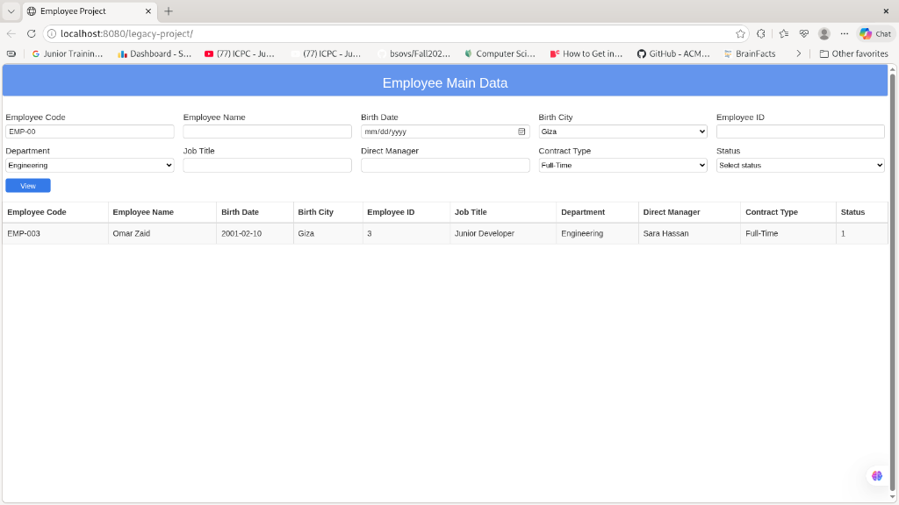

# � Employee Search Task

[](https://www.oracle.com/java/)
[](https://angularjs.org/)
[](https://jakarta.ee/)
[](https://maven.apache.org/)

A specialized technical task focused on implementing a **High-Precision Employee Search Engine**. This project demonstrates advanced multi-criteria filtering logic using a **Jakarta EE** backend and a reactive **AngularJS** frontend.

---

## 🚀 Search Features

- **🎯 Multi-Criteria Filtering**: Seamlessly search through employees by:
  - Employee Code & ID
  - Full Name (Partial matching)
  - Birth Date (Precise matching)
  - Birth City
  - Department & Job Title
  - Contract Type & Employment Status
- **📉 Dynamic Query Building**: Backend logic that constructs optimal SQL queries based on user-provided criteria.

---

## 📸 Search Gallery

### � Precise Code Search
Quickly locate specific employees using their unique code.



### 🏢 Department Filtering
Dynamic filtering to show all employees within a specific department.



### 📄 Searching by Contract Type
Filtered results based on employment terms like Full-Time or Part-Time.



### 📅 Advanced Date & City Search
Combining location and birth date for granular result targeting.



---

## 🚀 Getting Started

### Prerequisites
- Java 11+
- Apache Maven 3.x
- Apache Tomcat 10.1

### 🛠️ Detailed Setup Instructions

Follow these steps to get the project running on your local machine.

#### 1. Clone the Repository
```bash
git clone https://github.com/taherElzoghby27/Employee.git
cd Employee/legacy-project
```

#### 2. Build the Project
Use Maven to compile the code and package it into a `.war` file.
```bash
mvn clean install
```
The generated file will be located at `target/legacy-project.war`.

#### 3. Deploy to Apache Tomcat
Copy the generated WAR file to your Tomcat's `webapps` directory.
```bash
# Example for Linux/macOS
cp target/legacy-project.war /path/to/tomcat/webapps/

# Example for Windows (PowerShell)
Copy-Item target\legacy-project.war -Destination C:\path\to\tomcat\webapps\
```

#### 4. Access the Application
Start your Tomcat server and navigate to the following URL:
`http://localhost:8080/legacy-project/`

---

## 🗄️ Database Schema & Seed Data

This project uses an **Oracle SQL** compatible schema. You can use the following queries to set up your local environment and seed it with test data.

### 🔨 DDL: Table Definitions
```sql
CREATE TABLE Department (
    id INT GENERATED BY DEFAULT AS IDENTITY PRIMARY KEY,
    name VARCHAR(100) NOT NULL
);

CREATE TABLE Job (
    id INT GENERATED BY DEFAULT AS IDENTITY PRIMARY KEY,
    title VARCHAR(100) NOT NULL
);

CREATE TABLE ContractType (
    id INT GENERATED BY DEFAULT AS IDENTITY PRIMARY KEY,
    name VARCHAR(50) NOT NULL
);

CREATE TABLE UserTable (
    id INT GENERATED BY DEFAULT AS IDENTITY PRIMARY KEY,
    name VARCHAR(150) NOT NULL,
    code VARCHAR(50) UNIQUE,   
    birth_date DATE,
    birth_city VARCHAR(100),
    status NUMBER(1) DEFAULT 1 CHECK (status IN (0, 1)),
    job_id INT,
    department_id INT,
    contract_type_id INT,
    manager_id INT,
    CONSTRAINT fk_job FOREIGN KEY (job_id) REFERENCES Job(id),
    CONSTRAINT fk_dept FOREIGN KEY (department_id) REFERENCES Department(id),
    CONSTRAINT fk_contract FOREIGN KEY (contract_type_id) REFERENCES ContractType(id),
    CONSTRAINT fk_manager FOREIGN KEY (manager_id) REFERENCES UserTable(id) ON DELETE SET NULL
);
```

### 🌱 DML: Seed Data
```sql
INSERT INTO Department (name) VALUES ('Engineering');
INSERT INTO Department (name) VALUES ('Human Resources');
INSERT INTO Department (name) VALUES ('Sales');

INSERT INTO Job (title) VALUES ('Junior Developer');
INSERT INTO Job (title) VALUES ('Senior Developer');
INSERT INTO Job (title) VALUES ('HR Manager');
INSERT INTO Job (title) VALUES ('Department Head');

INSERT INTO ContractType (name) VALUES ('Full-Time');
INSERT INTO ContractType (name) VALUES ('Part-Time');
INSERT INTO ContractType (name) VALUES ('Freelance');

INSERT INTO USERTABLE (name, code, birth_date, birth_city, status, job_id, department_id, contract_type_id, manager_id)
VALUES ('Ahmed Mansour', 'EMP-001', TO_DATE('1985-05-15', 'YYYY-MM-DD'), 'Cairo', 1, 4, 1, 1,NULL);
INSERT INTO USERTABLE (name, code, birth_date, birth_city, status, job_id, department_id, contract_type_id, manager_id)
VALUES ('Sara Hassan', 'EMP-002', TO_DATE('1992-11-20', 'YYYY-MM-DD'), 'Alexandria', 1, 2, 1,1, 1 );
INSERT INTO USERTABLE (name, code, birth_date, birth_city, status, job_id, department_id, contract_type_id, manager_id)
VALUES ('Omar Zaid', 'EMP-003', TO_DATE('2001-02-10', 'YYYY-MM-DD'), 'Giza', 1, 1, 1, 1, 2  );
INSERT INTO USERTABLE (name, code, birth_date, birth_city, status, job_id, department_id, contract_type_id, manager_id)
VALUES ('Laila Reda', 'EMP-004', TO_DATE('1988-03-22', 'YYYY-MM-DD'), 'Mansoura', 1, 3, 2, 1, NULL);
INSERT INTO USERTABLE (name, code, birth_date, birth_city, status, job_id, department_id, contract_type_id, manager_id)
VALUES ('Khaled Nour', 'EMP-005', TO_DATE('1980-08-05', 'YYYY-MM-DD'), 'Cairo', 1, 4, 3, 1, NULL);
INSERT INTO USERTABLE (name, code, birth_date, birth_city, status, job_id, department_id, contract_type_id, manager_id)
VALUES ('Mona Fayed', 'EMP-006', TO_DATE('1995-01-12', 'YYYY-MM-DD'), 'Tanta', 1, 3, 2, 2, 4);
INSERT INTO USERTABLE (name, code, birth_date, birth_city, status, job_id, department_id, contract_type_id, manager_id)
VALUES ('Youssef Zaki', 'EMP-007', TO_DATE('1990-07-30', 'YYYY-MM-DD'), 'Alexandria', 1, 1, 3, 1, 5);
INSERT INTO USERTABLE (name, code, birth_date, birth_city, status, job_id, department_id, contract_type_id, manager_id)
VALUES ('Hoda Amr', 'EMP-008', TO_DATE('1998-12-05', 'YYYY-MM-DD'), 'Giza', 1, 1, 1, 2, 2);
```

### 🚀 Final Step
Deploy the `.war` to Tomcat and navigate to `http://localhost:8080/legacy-project/`

---
